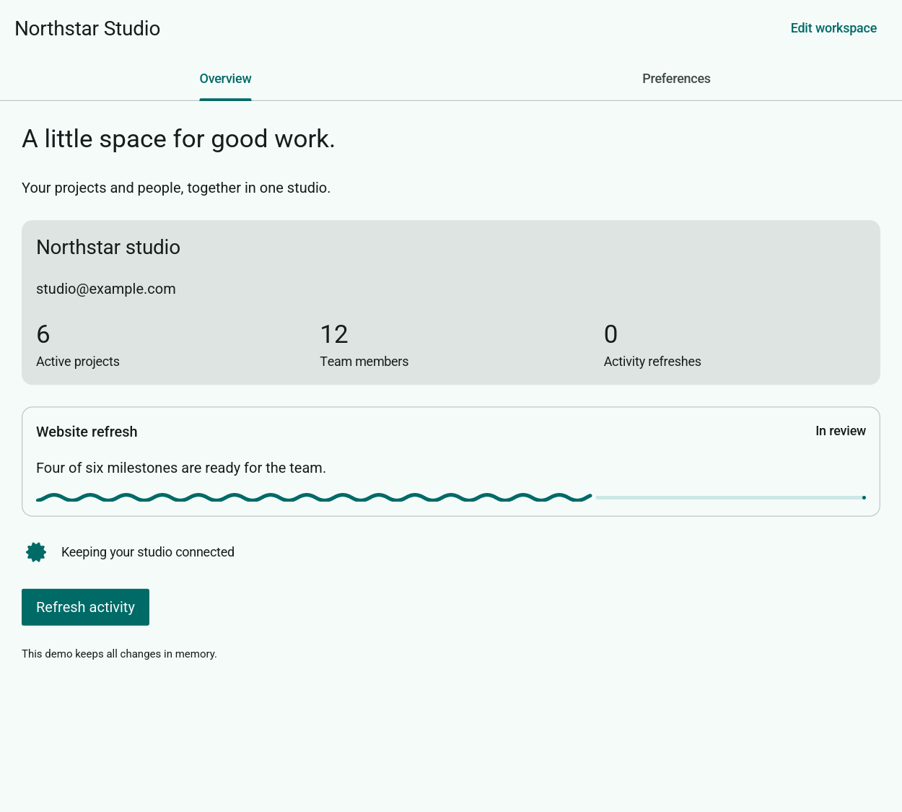

# iced-material

Material 3 components for desktop applications built with **upstream iced 0.14**.
Compose typed controls with ordinary iced layouts, semantic light/dark themes,
bundled Roboto, keyboard navigation, and animated interaction feedback.

**Status:** unpublished desktop beta; Rust **1.88+**. The API is still evolving.



*Northstar Studio combines Material controls with native iced widgets.*

## Quick start

Until a release is published, use a local checkout:

```toml
[dependencies]
iced-material = { path = "../iced-material" }
iced = { version = "=0.14.0", default-features = false, features = ["tiny-skia", "thread-pool"] }
```

```rust,no_run
use iced::widget::{column, container};
use iced_material::{button, fonts, text_field, Element, Theme};

#[derive(Default)]
struct App { name: String, saved: bool }

#[derive(Debug, Clone)]
enum Message { Name(String), Save }

impl App {
    fn update(&mut self, message: Message) {
        match message {
            Message::Name(name) => { self.name = name; self.saved = false; }
            Message::Save => self.saved = true,
        }
    }

    fn view(&self) -> Element<'_, Message> {
        iced_material::focus::scope(container(column![
            text_field("Your name", &self.name).on_input(Message::Name),
            button(if self.saved { "Saved" } else { "Save" })
                .on_press(Message::Save).disabled(self.name.trim().is_empty()),
         ].spacing(24)).padding(32))
    }
}

fn main() -> iced::Result {
    iced::application(App::default, App::update, App::view)
        .default_font(fonts::REGULAR)
        .theme(|_: &App| Theme::light())
        .title("Material example")
        .run()
}
```

This complete example is also in [examples/minimal.rs](examples/minimal.rs).
Your app owns values and messages; widgets handle their own animation scheduling.
Omitting a control's callback disables it.

## Components

| Area | Includes |
| --- | --- |
| Actions | Buttons, icon buttons, FABs, chips, segmented buttons |
| Input | Text fields, checkboxes, switches, radios, selects, sliders, date/time pickers |
| Navigation | App bars, tabs, navigation bars/rails, search, menus |
| Content and feedback | Cards, lists, carousels, dialogs, sheets, snackbars, tooltips, badges, progress and loading indicators |
| Foundations | Typography, surfaces, dividers, accent colors, elevation, reduced motion |

See the [component catalog](docs/COMPONENTS.md) for variants and the
[cookbook](docs/COOKBOOK.md) for composed examples.

## Integrating with iced

Use `iced_material::Element` and return a `Theme` from your application's theme
callback. Set `fonts::REGULAR` as the default font to match native iced text.
Wrap the view in `focus::scope` for keyboard traversal and activation.

The default `wgpu` feature enables GPU rendering with a software fallback.
See [getting started](docs/GETTING_STARTED.md) for software-only configuration
and faster development builds. Native and third-party iced widgets can share the
view; the [theming guide](docs/THEMING.md) explains the supported catalogs and
`Theme::iced()` adapter.

## Try it and learn more

From the source checkout:

```sh
cargo run --locked --example gallery
```

- [Getting started](docs/GETTING_STARTED.md) — application setup and rendering.
- [Cookbook](docs/COOKBOOK.md) — controls, overlays, navigation and feedback.
- [Theming](docs/THEMING.md) — colors, typography and native widget integration.
- [Gallery guide](docs/GALLERY.md) — walkthrough and independent sample app.
- [Documentation index](docs/README.md) — API docs, development and reference guides.

Run `cargo doc --open --no-deps` for the API reference and embedded consumer guides.

## Support and license

Desktop keyboard and pointer interaction are the focus. macOS has been tested
locally; Windows/Linux CI is configured but has not run remotely yet. Native
screen-reader integration, full localization/RTL and some Material variants remain
unfinished. See [support and limitations](docs/LIMITATIONS.md) before adopting.

Rust code is [MIT licensed](LICENSE). Bundled fonts and loading assets have their
own licenses; [NOTICE](./NOTICE) identifies them and the notices to retain.
