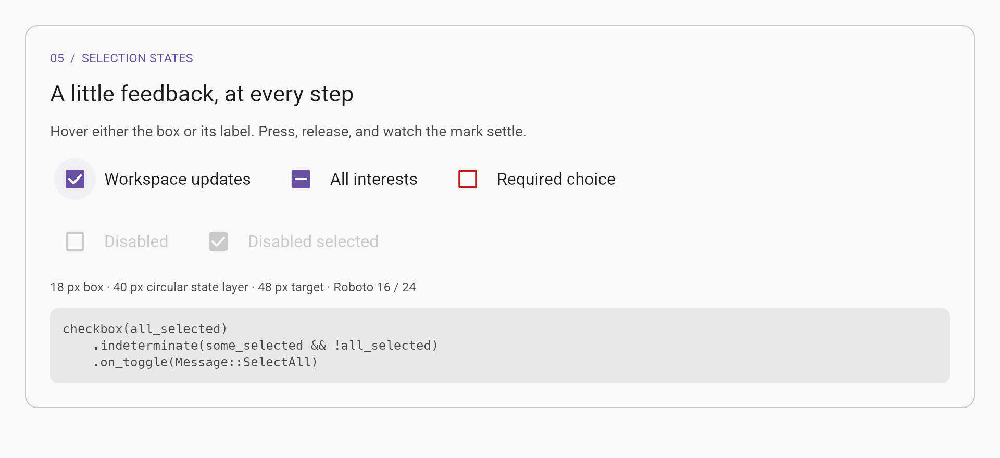
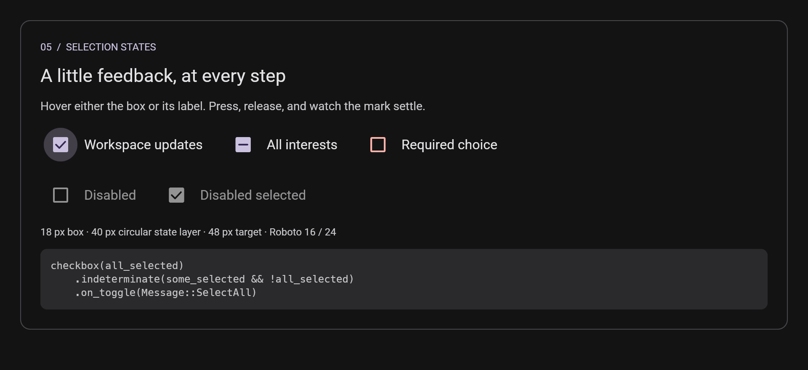

# Material visual comparison

Current audit: [catalog fidelity pass](FIDELITY.md) supersedes the remaining-work table below.

Historical update: [adaptive navigation and catalog completion](COMPLETION.md) supersedes earlier milestone notes about keyboard support, HCT palettes, pickers, sheet dragging, FAB expansion and Expressive previews.

Inspected 2026-09-12 against Material UI's live checkbox demonstration and
typography defaults, Material 3's checkbox specifications, and Google's Material
Web baseline tokens. This library follows **baseline Material 3**; MUI supplies
API and interaction references. MUI's checkbox documentation still points to
Material Design 2, so copying all of its default sizes and shapes would mix two
systems. This pass does not adopt the newer Material 3 Expressive component
families. [MUI checkbox](https://mui.com/material-ui/react-checkbox/),
[M3 checkbox specifications](https://m3.material.io/components/checkbox/specs).

## Gaps closed

| Area | Before | Now |
| --- | --- | --- |
| Typeface | Platform default fonts; no bundled Material face; text and input appearance could vary by machine | Bundled Roboto, loaded once automatically; Regular 400 and Medium 500 used consistently by typography, fields, button labels and selection labels |
| Type hierarchy | Six broad roles; a generic heading also used for dialogs | All 15 baseline M3 roles with explicit size, line height and weight; dialog title 24/32 and body 14/20 |
| Checkbox hover | Native iced styling tinted the unchecked box interior; selected hover barely changed | A circular 40 px state layer around the 18 px box, including hover on the label; 8% hover beneath a separate 12% press ripple |
| Checkbox motion | Instantaneous native checkmark change | Animated box/checkmark entry and exit, mixed-selection morph, fading hover and a centered ripple with separate expansion and release fading; transitions stop when settled |
| Checkbox states and target | Checked/unchecked/disabled with a small square target | A 48 px padded target plus clickable label, indeterminate and error appearances, disabled styling with no hover feedback |
| Tonal color roles | Primary container used for tonal and selected actions | Secondary container and its matching foreground, also improving selected chips |
| Dialog composition | Oversized heading, leading actions, filled confirmation button | Baseline heading/body roles and trailing text actions at the bottom |
| Scrolled vector marks | Software rendering could lose the checkmark after scrolling | Cached SVG drawing preserves marks and icon alignment through ancestor transforms |
| Small text details | Badges used supporting text; focused fields tinted helper text primary | Badges use Label Small 11/16 Medium; supporting text keeps its neutral role while focused |
| Switch feedback | Hover tinted the whole labeled button | A 40px halo follows the thumb; pressed thumb grows to 28px; the label stays untinted |
| Icon-button styles | Standard and selected variants inherited generic Button colors | Dedicated standard/outlined/filled/tonal colors, inverse outlined selection, neutral unselected filled toggles and selected disabled treatment |

The original type sizes were not all wrong: Body 16/24 and Label 14/20 already
matched M3. Missing Roboto, inconsistent weight selection, and using one heading
role everywhere caused much of the visible difference. MUI also defaults to
Roboto, but its type scale includes different roles and button treatment.
[MUI typography](https://mui.com/material-ui/customization/typography/),
[MUI default type definitions](https://github.com/mui/material-ui/blob/master/packages/mui-material/src/styles/createTypography.js).

Checkbox selection uses 350 ms entry and 150 ms exit, following Material Web's
baseline timings. Our checkmark drawing and easing are an original approximation
of the reference motion, not a frame-identical port. Its application value still
changes immediately on release; only the visual transition continues.
[M3 checkbox tokens](https://github.com/material-components/material-web/blob/main/tokens/versions/v0_192/_md-comp-checkbox.scss),
[Material Web checkbox motion](https://github.com/material-components/material-web/blob/main/checkbox/internal/_checkbox.scss).

The checkbox/radio press ripple was refined after the initial visual-test
milestone. It now expands over 450 ms using baseline Standard easing
(`cubic-bezier(0.2, 0, 0, 1)`), stays visible while held, and fades over 150 ms on
release. Quick taps retain feedback until at least 225 ms after pressing without
delaying their action. These expansion/minimum timings follow
[Material Web's ripple implementation](https://github.com/material-components/material-web/blob/main/ripple/internal/ripple.ts).
The centered origin remains a deliberate desktop-library choice. This is not an
exact Material Web ripple port: its soft edge and pointer-origin translation are
not reproduced. The existing hover circle stays visible beneath the press ripple,
following [Material Web's separate hover and ripple layers](https://github.com/material-components/material-web/blob/main/ripple/internal/_ripple.scss).
The 8% hover and 12% press layers produce about 19% combined opacity where they
fully overlap. Expansion has its own `theme.motion.ripple_expand` setting; other
component durations are independent.

## Typography now available

Measurements are logical pixels: font size / line height. Regular is weight 400;
Medium is 500. Existing short names such as `TypeScale::Body` remain aliases.

| Family | Large | Medium | Small | Weight |
| --- | --- | --- | --- | --- |
| Display | 57 / 64 | 45 / 52 | 36 / 44 | Regular |
| Headline | 32 / 40 | 28 / 36 | 24 / 32 | Regular |
| Title | 22 / 28 | 16 / 24 | 14 / 20 | Large Regular; others Medium |
| Body | 16 / 24 | 14 / 20 | 12 / 16 | Regular |
| Label | 14 / 20 | 12 / 16 | 11 / 16 | Medium |

[M3 type scale](https://m3.material.io/styles/typography/type-scale-tokens),
[baseline type tokens](https://github.com/material-components/material-web/blob/main/tokens/versions/v0_192/_md-sys-typescale.scss).

Letter spacing remains a specific gap: iced 0.14's native `Text` and `TextInput`
APIs do not expose tracking. `TypeScale::tracking()` records the reference values
but does not apply them. Applying tracking consistently would require deeper text
layout work; inserting literal spaces would break normal shaping and editing.
Native input behavior is preserved.

## Subsequent component milestone

Menus/dropdown selection, plain tooltips, snackbars and radio groups have now been
added using the same baseline typography, theme roles and interaction foundation.
See [WORKFLOWS.md](WORKFLOWS.md) for their reference tokens, screenshots and remaining
refinements.

Tabs, lists, a small app bar and a navigation rail were added next. Their baseline
measurements, typography roles and interaction scope are recorded in
[NAVIGATION.md](NAVIGATION.md). The gallery now demonstrates Workspace, Activity
and Settings pages, with responsive navigation and nested list controls.

## Historical remaining visual work (superseded)

This is an implementation audit, not a claim of pixel-perfect conformance.
The switch state-layer and icon-button color gaps were closed in the navigation
milestone. Remaining work includes deeper focus support, text tracking and ripple fidelity.

| Component / foundation | Current assessment | Remaining gap |
| --- | --- | --- |
| Switch | Baseline 52×32 track, 40px thumb-centered halo and animated/pressed thumb sizing | Optional thumb icons are not implemented; easing is an approximation |
| Buttons | Baseline 40 px height, rounded shape, Roboto Medium labels, correct tonal roles | Rounded tonal press layer rather than a pointer-origin ripple; no elevated-button variant |
| Icon buttons | 40 px action, 24 px content, centered gallery vectors and dedicated variant/toggle colors | Tonal press layer instead of a pointer-origin ripple; no focus treatment |
| Text fields | 56 px field, 16 px value, 12 px floating label/support, 1/2 px outlines; corrected supporting-text role | Detailed hover/error color rules and tracking need refinement |
| Dialog | 28 px corners, 24 px padding, corrected typography and action placement | No open/close transition; content/actions remain application composition |
| Chips | 32 px height, 8 px corners, corrected selected container roles | Generic button outline/text colors; no built-in leading selection check or trailing remove action |
| Cards / surfaces | Filled, outlined and elevated variants share a coherent scale | Surface-container level selection and shadow recipes approximate M3 elevation |
| Badges | Count pill, 11 px Medium label, error/on-error colors, overflow label | No built-in small dot or anchor layout |
| Dividers | Thin outline-variant divider | Inset/vertical variants require composition or native iced widgets |
| Palette | Semantic light/dark roles and tested contrast | sRGB tone approximation, not Google's HCT; neutrals and accent chroma visibly differ from official schemes |
| Interaction coverage | Mouse states and finite motion | Keyboard/focus visuals, screen readers and reduced-motion mode remain outside the agreed initial scope |

Reference anchors for these component details:
[buttons](https://m3.material.io/components/buttons/specs),
[switches](https://m3.material.io/components/switch/specs),
[text-field tokens](https://github.com/material-components/material-web/blob/main/tokens/versions/v0_192/_md-comp-outlined-text-field.scss),
[badge tokens](https://github.com/material-components/material-web/blob/main/tokens/versions/v0_192/_md-comp-badge.scss),
[dialog tokens](https://github.com/material-components/material-web/blob/main/tokens/versions/v0_192/_md-comp-dialog.scss),
[tonal-button tokens](https://github.com/material-components/material-web/blob/main/tokens/versions/v0_192/_md-comp-filled-tonal-button.scss).

## Verification and examples

The gallery now has a selection-states panel for normal, mixed, error and disabled
checkboxes. Its checked and mixed values are connected to real gallery state.
The renders below use the default GPU renderer and show the first checkbox hovered.
Both GPU and software outputs were inspected; their alpha blending and antialiasing
differ, most visibly in disabled states.

The previous overview is preserved in [gallery-before-material-audit.png](gallery-before-material-audit.png);
the updated overview is [gallery.png](gallery.png). Font changes can alter line
breaks and control widths, so these are visual inspection artifacts rather than
pixel-golden tests. See [VALIDATION.md](VALIDATION.md) for executed checks and
platform limits.

The checkbox helper now returns the library's `Checkbox` builder, rather than
iced's native checkbox. Common label, sizing, font and callback builders remain;
native-only `.style`, `.class` and `.icon` builders are not part of the new helper.
Applications can still compose a native `iced::widget::Checkbox` using the
Material theme's catalog when they need that API and accept its static behavior.
