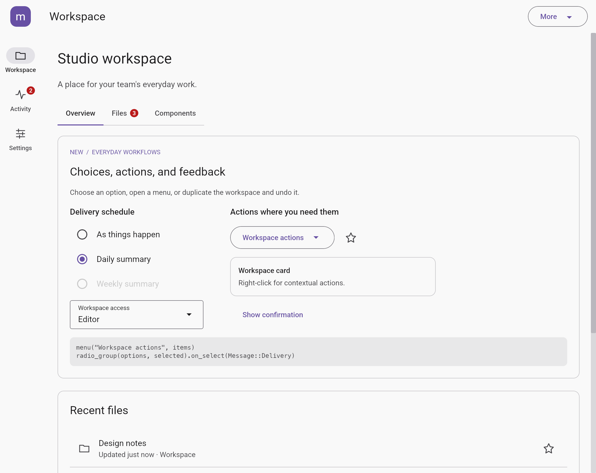
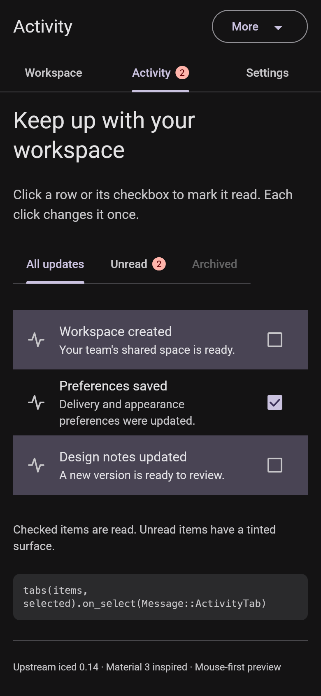

# Navigation and structured content

Current update: [adaptive navigation and catalog completion](COMPLETION.md) supersedes earlier milestone notes about keyboard support, HCT palettes, pickers, sheet dragging, FAB expansion and Expressive previews.

Milestone 4 adds primary/secondary tabs, lists, a small app bar and a navigation
rail. The gallery is now a small Workspace / Activity / Settings application.
It also closes the switch hover and icon-button color gaps from the visual audit.
The implementation stays on released upstream iced 0.14 with no new dependency.

## Baseline Material 3 reference

The measurements below use Google's baseline Material Web v0.192 tokens, consistent
with the existing components. New Material 3 Expressive variants are outside this
milestone. Typography uses the already bundled Roboto and shared type scale.

| Component | Implemented baseline | Reference |
| --- | --- | --- |
| Primary tabs | 48px label-only or 64px icon+label; Title Small 14/20 Medium; primary selection and 3px rounded-top indicator | [Primary-tab tokens](https://github.com/material-components/material-web/blob/main/tokens/versions/v0_192/_md-comp-primary-navigation-tab.scss) |
| Secondary tabs | 48px; Title Small; on-surface selected label and primary 2px full-tab indicator | [Secondary-tab tokens](https://github.com/material-components/material-web/blob/main/tokens/versions/v0_192/_md-comp-secondary-navigation-tab.scss) |
| Lists | 56/72/88px minimum rows; 16px horizontal padding; Body Large headline, Body Medium supporting text and Label Small overline | [List tokens](https://github.com/material-components/material-web/blob/main/tokens/versions/v0_192/_md-comp-list.scss) |
| Small app bar | 64px height; Title Large 22/28; surface at rest, surface-container and elevation when scrolled | [App-bar tokens](https://github.com/material-components/material-web/blob/main/tokens/versions/v0_192/_md-comp-top-app-bar-small.scss) |
| Navigation rail | 80px width; 24px icon in a 56×32 secondary-container selection pill; Label Medium 12/16 | [Rail tokens](https://github.com/material-components/material-web/blob/main/tokens/versions/v0_192/_md-comp-navigation-rail.scss) |
| Switch | 52×32 track; 16px off/24px on thumb; 28px pressed thumb and a 40px circular state layer that follows the thumb | [Switch tokens](https://github.com/material-components/material-web/blob/main/tokens/versions/v0_192/_md-comp-switch.scss) |

Icon buttons retain their existing builder API but now have component-specific
standard, outlined, filled and tonal treatments. Standard selection uses primary
on a transparent surface. Outlined selection uses inverse surface/on-surface;
its selected disabled state retains a 12% container. Unselected filled/tonal toggles
use the new `surface_container_highest` role. References:
[standard](https://github.com/material-components/material-web/blob/main/tokens/versions/v0_192/_md-comp-icon-button.scss),
[outlined](https://github.com/material-components/material-web/blob/main/tokens/versions/v0_192/_md-comp-outlined-icon-button.scss),
[filled](https://github.com/material-components/material-web/blob/main/tokens/versions/v0_192/_md-comp-filled-icon-button.scss),
[tonal](https://github.com/material-components/material-web/blob/main/tokens/versions/v0_192/_md-comp-filled-tonal-icon-button.scss).

## Behavior and composition

- Tabs and rail destinations report typed values. Selection, routing and displayed
  content belong to the application. Missing callbacks disable destinations.
  Per-item disabling is supported; clicking the current destination reports that value.
- Tabs support equal widths or natural widths with horizontal scrolling. Primary
  icon tabs place a count badge beside the icon; other tab badges sit beside labels.
  Concise labels suit fixed tabs; longer labels and counts should use scrolling.
  Indicator transitions are internal and stop scheduling frames when settled.
- Lists accept leading/trailing content, including independent checkboxes, switches,
  menus and action buttons. A trailing action handles its own click before the row.
  Crossing between child and row during a drag cancels the gesture. Rows without an
  action remain static while their controls work. Disabled rows block all input;
  custom children need their own disabled styling in the consuming view.
- App bars take a title, optional leading content and any number of trailing actions.
  Long titles clip within their allotted slot. `.scrolled(bool)` is controlled by
  the application; it does not install a scroll listener. Keep actions compact.
- Rails scroll their header and destinations when tall; the optional footer stays
  below the scrolling area. Rail hover feedback covers the icon pill and remains
  visible on the selected destination. Supply passive, square icon content.

The gallery changes navigation at 700px, keeping application preferences and tab
values intact. Workspace contains Overview, Files and Components tabs. Activity
supports an unread filter and mark-read rows/checkboxes. Settings contains theme,
form and selection examples. The app bar's More menu opens preferences, changes
window width or shows confirmation feedback. It uses the same public components
as downstream applications; there is no gallery-only routing abstraction.

## Deliberate limits

This remains a mouse-first desktop preview. Keyboard tab traversal, arrow-key
selection, focus rings, screen-reader semantics and focus restoration are still
deferred. Tabs do not automatically reveal programmatic selection in a scrolled
strip. Lists are not virtualized; long labels wrap and can grow beyond baseline
row heights. Avatars/images and secondary text arrangements use ordinary iced
composition. App bars do not collapse; rail selection changes immediately with
animated hover/press feedback, while tabs animate their indicator. A navigation
bar/drawer, routing/history framework, switch thumb icons and pointer-origin
ripples are outside this milestone. Theme tones and easing remain approximations.

## Verification

Nineteen component interaction/render tests and two gallery flow tests were added.
They cover overflow scrolling, disabled and interrupted gestures, child-vs-row
actions, nested menu overlays, root dialog blocking, state across rebuilds, long
app-bar title clipping, tab badge visibility, finite indicator/halo motion and
rendering under scroll translations. Gallery flows exercise navigation at wide
and narrow widths, persistent settings and unread filtering.

The visual generators produce sixteen gallery cases and four focused navigation
cases for each renderer. Focused fixtures intentionally use a small square ink
marker to make inherited icon foregrounds easy to compare. The gallery uses cached
SVG icons. See [VALIDATION.md](VALIDATION.md) for executed checks and platform limits.
