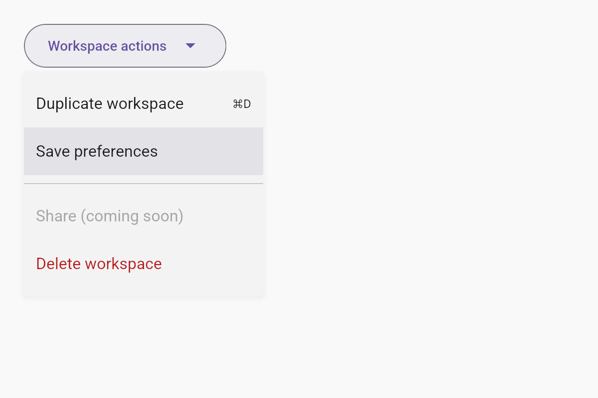
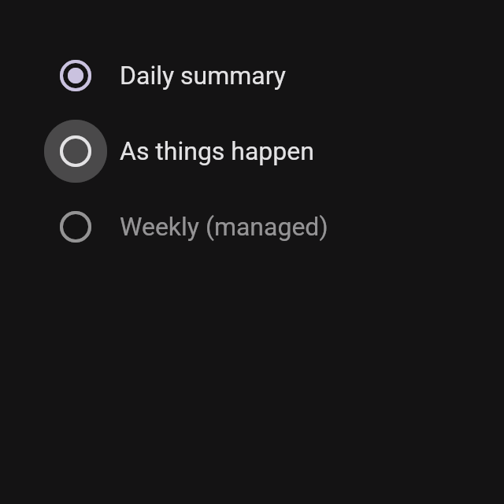

# Everyday workflows

This milestone adds menus, dropdown selection, plain tooltips, snackbars and radio
buttons/groups to the existing iced 0.14 library. The gallery's **Everyday
workflows** panel lets you change delivery/access choices, open action and
right-click menus, duplicate the workspace, and undo that duplication from a
snackbar. The access dropdown also appears inside the settings dialog.

## Reference and implementation

The baseline Material 3 tokens from Google's Material Web repository were checked
for these components. This follows the existing visual system; newer Expressive
variants are outside this pass.

| Component | Applied baseline measurements and roles | Reference |
| --- | --- | --- |
| Menus | Surface container, elevation 2, 4px corners, 8px vertical padding, 48px single-line rows, Body Large, secondary-container selection | [Menu tokens](https://github.com/material-components/material-web/blob/main/tokens/versions/v0_192/_md-comp-menu.scss) |
| Plain tooltips | Inverse surface/on-surface, Body Small 12/16, 4px corners, 4px vertical and 8px horizontal padding | [Tooltip tokens](https://github.com/material-components/material-web/blob/main/tokens/versions/v0_192/_md-comp-plain-tooltip.scss) |
| Snackbars | Inverse surface/on-surface, inverse-primary action, Body Medium 14/20, Label Large action, 4px corners, elevation 3; 48px single-line and 68px two-line height | [Snackbar tokens](https://github.com/material-components/material-web/blob/main/tokens/versions/v0_192/_md-comp-snackbar.scss) |
| Radios | 20px ring, 10px dot, 40px circular state layer, 48px target, primary selection, on-surface-variant outline; finite hover/press/selection motion | [Radio tokens](https://github.com/material-components/material-web/blob/main/tokens/versions/v0_192/_md-comp-radio-button.scss) |

Menus allow longer labels to wrap rather than clip to a fixed row height.
Snackbars can grow beyond two lines at narrow widths, keeping text and the action
reachable. The select uses a 56px outlined trigger with a persistent label and
value; a floating notched select label is a remaining visual refinement. Its
arrow is an SVG, so it shares the button foreground without a font-baseline offset.
The 500ms tooltip delay, four-second snackbar duration and 240px menu width are
configurable desktop defaults. They are implementation choices, not claims that
every M3 platform uses identical timing or widths.

## Interaction and scope

- Menus scroll, flip near edges, and work after scrolling an ancestor. Disabled
  items cannot emit actions. Escape/outside dismissal captures input, and nested
  menus close before their containing dialog. Selected items and shortcut hints
  are supported; bindings belong to application code.
- Radios and selects report typed application values. Radios cannot toggle the
  current choice off. Hover/press effects and radio selection settle without an
  idle redraw loop.
- Tooltips stay noninteractive, delay their appearance, and suppress reopening
  after dismissal until the pointer leaves.
- Snackbars publish an action or timeout once. IDs distinguish repeated notices;
  rebuilds preserve remaining time. Hover, deactivation and root dialogs pause
  the timeout. Background controls retain state, and a covered release cancels
  an earlier press instead of creating a later accidental action.
- Full keyboard navigation, screen-reader semantics, submenus, rich tooltips,
  autocomplete, notification queues and popup entrance/exit motion are deferred.
  The release remains a mouse-first preview.

## Inspection artifacts

Run `cargo test --locked --no-default-features --test workflows workflow_snapshots -- --ignored`
to produce ten light/dark, narrow, edge-placement and dialog-menu renders in
`target/visuals/`. Run with `ICED_TEST_BACKEND=wgpu` and default features for a GPU
comparison. These are inspection artifacts, not portable golden-image assertions.

See [VALIDATION.md](VALIDATION.md) for executed checks and native/platform limits.
